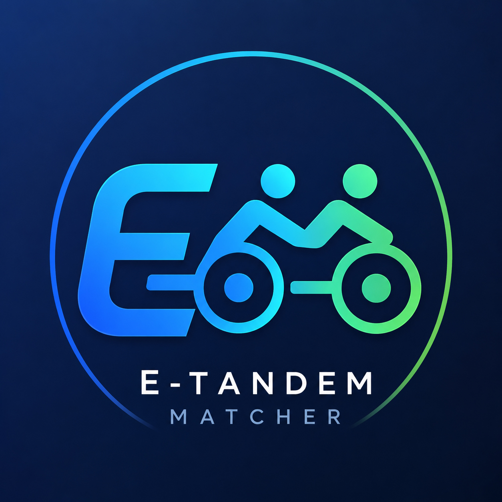
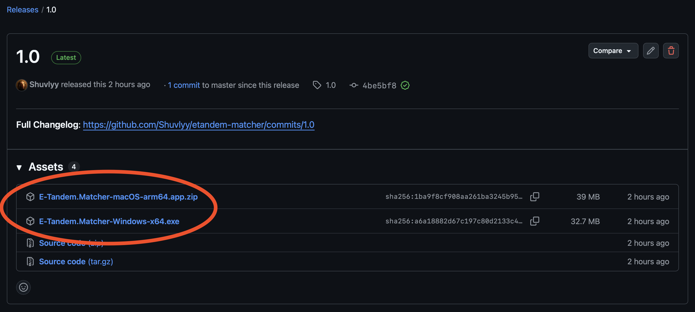
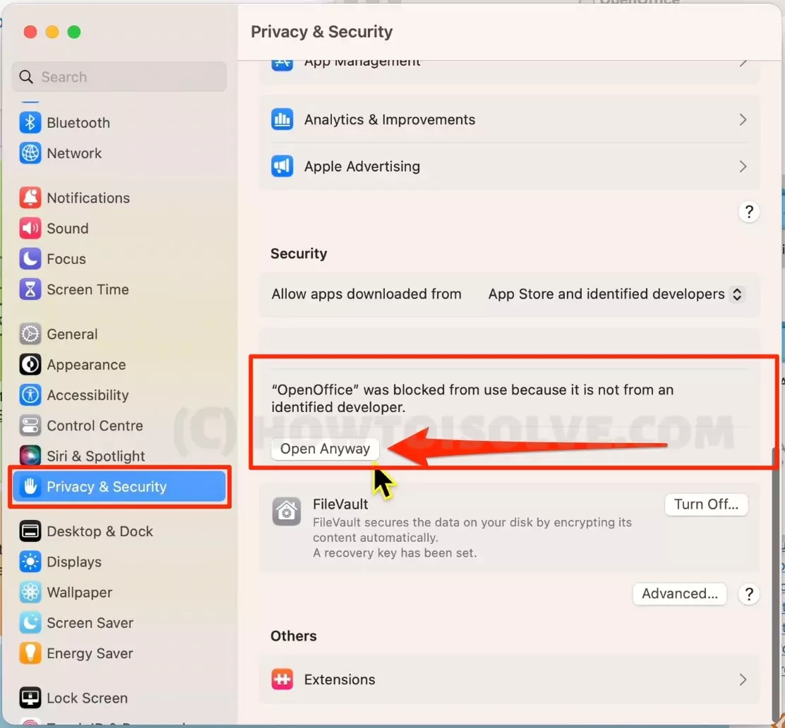
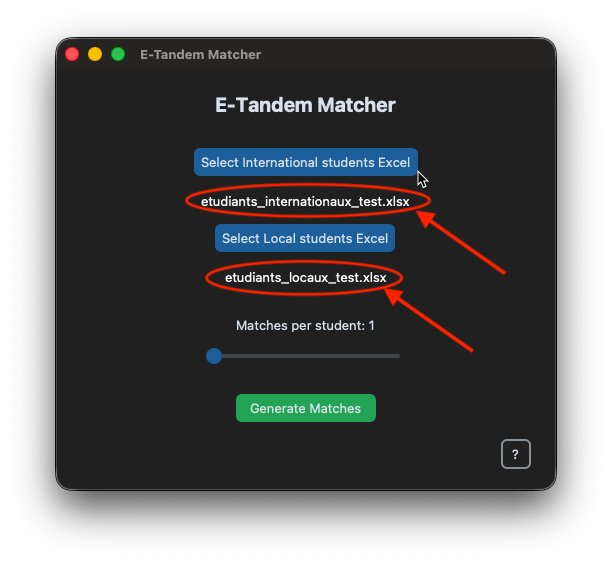

# E-Tandem Matcher

Voici le guide d'utilisation du nouvel outil de création de binômes dans le cadre du programme E-Tandem de l'Université de Nantes. Il lit les réponses aux formulaires et calcule automatiquement les meilleures affinités entre les étudiants locaux et internationaux.

## Installation

Téléchargez l'application depuis la [release la plus récente](https://github.com/Shuvlyy/etandem-matcher/releases/latest) et sélectionnez votre plateforme (Windows ou macOS).



## Compilation (développeurs uniquement)

Pour compiler l'application, vous aurez besoin de [Python 3.14](https://www.python.org/downloads/) et de [`pip`](https://pip.pypa.io/en/stable/).

1. Installez les dépendances :
   ```sh
   pip install -r requirements.txt
   ```

2. Compilez l'application à l'aide du script `build.py` :
   ```sh
   python build.py
   ```

3. Le script va générer un fichier exécutable dans le dossier `dist`. Notez que le fichier généré est spécifique à votre plateforme (Windows ou macOS).

## Utilisation

1. Lancer l'application\
Double-cliquez sur le fichier `E-Tandem Matcher.exe` pour lancer l'application.

> [!IMPORTANT]
> Pour Windows: Si votre antivirus bloque le lancement du logiciel : Étant donné qu'il s'agit d'un petit logiciel interne, certains antivirus peuvent bloquer son lancement. Cliquez simplement sur "Informations complémentaires" puis sur "Exécuter quand même" pour le lancer.

> 

> [!IMPORTANT]
> Pour macOS: Si votre ordinateur refuse de lancer l'application : Pour les mêmes raisons que sur Windows, macOS peut bloquer l'accès à l'application. Autorisez l'accès à l'application dans les paramètres de sécurité de macOS comme montré sur la capture d'écran (vous devrez descendre en bas de la page pour voir le bouton ***"Ouvrir quand même"***).

> 

2. Insérer les fichiers Excel

 - Cliquez sur le bouton **"Select International students Excel"** et allez chercher le fichier des étudiants internationaux.
 - Cliquez sur le bouton **"Select Local students Excel"** et allez chercher le fichiers des étudiants locaux.\
\
 Une fois les fichiers choisis, vous devriez voir leur nom s'afficher en blanc en dessous des boutons.



3. Choisir le nombre de propositions\
Utilisez le curseur **"Matches per student"** pour choisir combien de partenaires potentiels le logiciel doit vous proposer pour chaque étudiant international.

4. Lancer le calcul\
Cliquez sur le gros bouton vert **"Generate Matches"**. Une nouvelle fenêtre s'ouvrira avec les résultats.


5. Sauvegarder les résultats\
Pour sauvegarder les résultats sous forme de fichier Excel, cliquez simplement sur le bouton **"Export to Excel"** et choisissez un emplacement pour le fichier.

## Fonctionnement

Pour faire court, le logiciel donne des points à chaque duo selon ces critères :
- __Les passions communes (le plus important) :__ +5 pts par passion commune
- __Le niveau de langue :__ Le logiciel associe les étudiants débutants avec des étudiants confirmés pour que l'échange soit équilibré et que personne ne soit bloqué (par exemple les A2 iront plus avec des C1).
- __La filière :__ +3 pts si les deux étudiants sont dans la même filière.
- __L'écart d'âge :__
  - ≤ 2 ans d'écart : +5 pts
  - 2 à 4 ans d'écart : +2 pts

Les propositions sont ensuite triées par ordre décroissant de score, avec les meilleures propositions en haut.

## Un problème?

- L'application affiche ***"Please select both Excel files first"*** : Vous avez oublié de charger l'un des deux fichiers ou vous avez cliqué trop vite. Assurez-vous que vous avez bien sélectionné les deux fichiers et qu'ils apparaîssent en blanc en dessous des boutons avant de lancer le calcul.
- L'application affiche ***"Something went wrong"*** : Vérifiez que les fichiers que vous avez sélectionnés sont bien des vrais fichiers Excel (`.xlsx`) et que la structure des ces fichiers correspond bien à celle des formulaires.

Si vous avez besoin d'aide, vous pouvez me joindre à cette adresse e-mail : [lysandre.boursette@epitech.eu](mailto:lysandre.boursette@epitech.eu).


