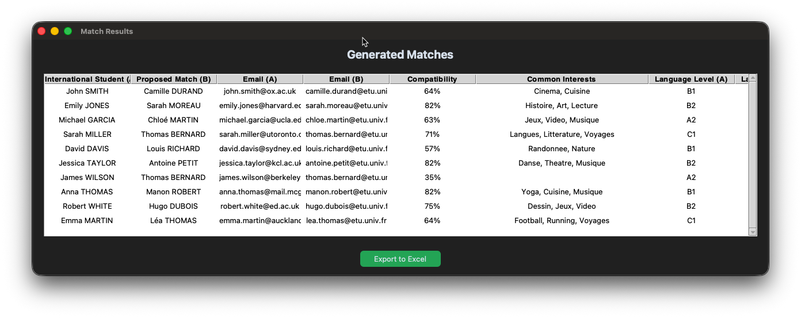
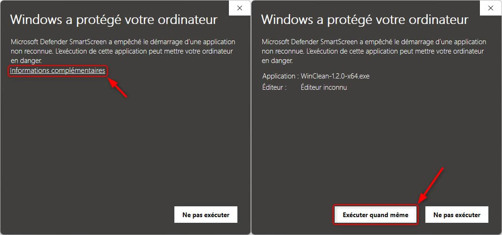

# E-Tandem Matcher

Voici le guide d'utilisation du nouvel outil de création de binômes dans le cadre du programme E-Tandem de l'Université de Nantes. Il lit les réponses aux formulaires et calcule automatiquement les meilleures affinités entre les étudiants locaux et internationaux.

## Utilisation

1. Lancer l'application\
Double-cliquez sur le fichier `E-Tandem Matcher.exe` pour lancer l'application.

2. Insérer les fichiers Excel

 - Cliquez sur le bouton **"Select International students Excel"** et allez chercher le fichier des étudiants internationaux.
 - Cliquez sur le bouton **"Select Local students Excel"** et allez chercher le fichiers des étudiants locaux.\
\
 Une fois les fichiers choisis, vous devriez voir leur nom s'afficher en blanc en dessous des boutons.

3. Choisir le nombre de propositions\
Utilisez le curseur **"Matches per student"** pour choisir combien de partenaires potentiels le logiciel doit vous proposer pour chaque étudiant international.

4. Lancer le calcul\
Cliquez sur le gros bouton vert **"Generate Matches"**. Une nouvelle fenêtre s'ouvrira avec les résultats.

5. Sauvegarder les résultats\
Pour sauvegarder les résultats sous forme de fichier Excel, cliquez simplement sur le bouton **"Export to Excel"** et choisissez un emplacement pour le fichier.

## Fonctionnement

Pour faire court, le logiciel donne des points à chaque duo selon ces critères :
- Les passions communes (le plus important) : +5 pts par passion commune
- Le niveau de langue : Le logiciel associe les étudiants débutants avec des étudiants confirmés pour que l'échange soit équilibré et que personne ne soit bloqué (par exemple les A2 iront plus avec des C1).
- La filière : +3 pts si les deux étudiants sont dans la même filière.
- L'écart d'âge:
  - <= 2 ans d'écart : +5 pts
  - Entre 2 et 4 ans d'écart : +2 pts

Les propositions sont ensuite triées par ordre décroissant de score, avec les meilleures propositions en haut.

## Un problème?

- L'application affiche ***"Please select both Excel files first"*** : Vous avez oublié de charger l'un des deux fichiers ou vous avez cliqué trop vite. Assurez-vous que vous avez bien sélectionné les deux fichiers et qu'ils apparaissent en blanc en dessous des boutons avant de lancer le calcul.
- L'application affiche ***"Something went wrong"*** : Vérifiez que les fichiers que vous avez sélectionnés sont bien des vrais fichiers Excel (`.xlsx`) et que la structure des ces fichiers correspond bien à celle des formulaires.
- Mon antivirus bloque le lancement du logiciel : Étant donné qu'il s'agit d'un petit logiciel interne, certains antivirus peuvent bloquer son lancement. Cliquez simplement sur "Informations complémentaires" puis sur "Exécuter quand même" pour le lancer.

Si vous avez besoin d'aide, vous pouvez me joindre à cette adresse e-mail : [lysandre.boursette@epitech.eu](mailto:lysandre.boursette@epitech.eu).
